# Platinum Weather Card Plus Charts

A mashup of [Platinum Weather Card](https://github.com/tommyjlong/platinum-weather-card) and [Weather Chart Card](https://github.com/mlamberts78/weather-chart-card) — two of the best weather cards for Home Assistant, neither of which has seen active development for a while. I used to run Weather Chart Card on my main dashboard and Platinum on a dedicated weather view. At some point it felt pointless to maintain two separate cards with overlapping functionality, so I merged them as far as makes sense.

Based on the original Platinum Weather Card by [@makin-things](https://www.github.com/makin-things), extended by [@tommyjlong](https://github.com/tommyjlong). Weather Chart Card by [@mlamberts78](https://github.com/mlamberts78). Maintained and further developed here by [@rudizl](https://github.com/rudizl).

[](https://github.com/hacs/default)
[![GitHub Release][releases-shield]][releases]
[](https://github.com/rudizl/platinum-weather-card-plus-charts/releases)


[![License][license-shield]](LICENSE.md)
[](https://github.com/rudizl/platinum-weather-card-plus-charts/actions/workflows/build.yml)

## Installation

The card is in the HACS default store:

1. HACS → search for **Platinum Weather Card Plus Charts**
2. Download
3. Hard-refresh your browser

---

<details>
<summary><strong>Changelog</strong></summary>

**v2.3.1**
- The pyranometer settings moved to Global Options. They were behind the cloud cover slot, which meant the icon correction could not be used without also displaying a reading nobody had asked for — the two are independent and are now configured independently

---

**v2.3.0**

**Local forecast reworked**
- The semidiurnal atmospheric tide is subtracted from the pressure trend. At mid latitudes it reaches 0.32 hPa/h on its own, so an uncorrected forecast deteriorated every afternoon and recovered every morning regardless of the weather. ⚠️ Set **Pressure trend window** to match your Derivative helper — default 3 hours
- Wind direction is used only when steady: gate raised to 8 km/h, plus a circular-concentration test over the last 15 minutes. A vane in light air sweeps the whole compass, and the algorithm applies up to ±8.35 hPa from the bearing
- Thresholds raised to ±0.30 hPa/h in, ±0.20 out — the scale the algorithm was built around
- The tendency clause is read live, so it can no longer contradict the pressure slot's arrow (#12)
- The README now states plainly what a purely barometric method cannot see

**New: warnings section** — an active severe-weather warning from MeteoAlarm or any CAP-compatible integration, in the card's own language rather than the feed's, with visual weight following the severity level

**New: cloud cover from a pyranometer** (#19) — measured rather than forecast, with an optional icon correction that acts only on a flat contradiction

**New: the sun decides day/night icons** — some providers report `clear-night` with the sun 35° above the horizon

**Inherited requests**
- Decimals on wind speed and gust (#15)
- Each source on its own line in the extended section (#16)
- Alignment for the condition text (#17) — honoured by the stylesheet all along, but missing from the editor and documentation

**Fixes**
- Wind slot showed `unavailable NaNkm/h` when its sensors dropped out; six slots printed `NaN` or leaked the raw state
- A single `null` in the forecast poisoned the whole temperature chart rather than leaving one gap
- Precipitation units follow the sensor instead of assuming mm or inches
- `Entity_forecast_max` was capitalised in a 2022 migration, silently discarding the maximum temperature for anyone with an older config
- Moving the first section up wrote `undefined` into `section_order` and the section vanished
- The temperature-decimals migration deleted its own setting
- Wind speed ignored the sensor's unit

**Editor** — section names lost the redundant "section", controls stay on one line on a phone, and the two-column rows are a real grid

**Tests** — the project had none at the start of this cycle and now has 283, run on every build. Eleven of the fixes above were found by writing them

---

**v2.2.3**

The card is now available in the **HACS default store** — no custom repository needed.

**New**
- The current temperature and the apparent ("feels like") temperature open their history in the more-info dialog when tapped, matching the slot values. Requested by @blaal02

**Fixes**
- A long press on a tappable reading also fired the card's own hold action. The tap handlers stop the click, but the card starts its hold timer on `pointerdown`, which has already propagated by then. Affects the slot taps introduced in v2.2.0

**Docs**
- `option_show_gust_in_wind` and `option_show_beaufort` were working but undocumented

---

**v2.2.2**

**Fixes**
- **Charts and daily forecast disappeared** when both sections were enabled (v2.2.1 only). The chart's tooltip code still referenced a variable removed by the v2.2.1 date-alignment fix, throwing `ReferenceError: startIdx is not defined` and aborting the render of both sections. Reported by @jerrymjones (#13)
- **Security: tooltip contents are now escaped.** The chart and forecast tooltips are assembled as HTML strings and passed through `unsafeHTML`. Forecast descriptions and unit strings taken from entity attributes were interpolated unescaped, so crafted attribute data could inject markup into the dashboard. All string values are now HTML-escaped and numeric values are validated before they reach a style attribute. Reported by @frenck during HACS review

**Build**
- Type checking is now part of `npm run build`. It had been silently broken: syntax errors inside `@types/node` aborted `tsc` before it ever reached the card's sources, so the missing variable above shipped without a warning. Node types are excluded and the twenty-one type errors this exposed are fixed

---

**v2.2.1**

**Fixes**
- Chart and daily forecast strip could show a different number of days, with the chart's points landing under the wrong columns. The strip resolves each day by date and stops when one is missing; the chart used plain array indices, so whenever the provider's forecast array had not rolled over yet (just after midnight) the two drifted apart. The chart now walks dates with the same lookup and cut-off rule
- Wind bearings returned as Cyrillic abbreviations were not recognised — Weather Underground mixes them with the Latin ones in the same response (`Ю`, `NNE`, `ESE`, `SE`, `И`). Those days showed no wind arrow, and the local Zambretti forecast silently dropped its wind correction. All 16 Bulgarian abbreviations plus the Russian/Ukrainian `В` family are now parsed
- Three inline copies of the compass table (forecast arrow, both tooltip builders) replaced by the shared one, so a fix in one place can no longer miss the others

**Docs**
- The Zambretti section now warns that the local forecast needs sea-level (relative) pressure, with a ten-second check for an uncalibrated station and the two places the correction can be made

---

**v2.2.0**

**New: Tap on slot value opens history** (#9)
- Tap any slot value (humidity, pressure, wind, ...) and the native more-info dialog opens with the history/statistics graph. Only sensor-backed slots are tappable (pointer cursor + hover highlight); weather-attribute slots stay inert. Card-level tap/hold actions unaffected. `option_slot_tap_more_info`, on by default

**New: Long text can no longer break the slot layout** (#10 follow-up)
- Slot columns are pinned 50/50; long texts (moon phase, UV, fire danger, custom values) truncate with an ellipsis and a hover tooltip instead of collapsing the section to a single column
- Slot layout converted from CSS tables to flex, scoped to the slots section

**New: HA interface language as default** (#8 discussion)
- When Locale is left empty, the card now follows the Home Assistant interface language for texts and dates (previously: English texts + browser-language dates). The Locale dropdown remains a full override

**Translations**
- 🇨🇿 Czech — thanks @VlastiBroucek (#11), the card's first community translation; selectable in the editor dropdown
- English Zambretti texts modernized per @jerrymjones's native review: "fine" → "fair", "Fairly fine" → "Mostly fair", "Changeable, mending" → "Changeable, improving", "Very unsettled" (short + verbose sets)
- German reviewed by a native speaker (@00pi) — no changes needed

**Fixes**
- "uv_rating 6" instead of "UV 6" — translation key lost in the v2.1.0 i18n rework, added in all 13 languages (thanks @00pi)
- Forecast column numbers could overlap (caught by @00pi)
- Language count corrected in docs (13)

---

**v2.1.1**
- New option **"Moon phase: icon only"** (`option_moon_icon_only`) — hides the moon phase text, keeping just the icon. Long phase names (e.g. German "Zunehmender Dreiviertelmond") could force the slot section into a single column (#10, thanks @00pi)
- Moon phase text now shows the full name as a tooltip on hover

---

**v2.1.0**

**New: Local forecast (Zambretti)**
- The card can compute a short local forecast entirely from your own weather station — no internet, no forecast provider. Classic Zambretti forecaster (1915, ~90% accuracy for the next 12h) using barometric pressure, its trend, wind direction and season
- Enable via Overview Section → Options; the computed text replaces `entity_summary`. 26 forecast texts fully translated in all 13 languages
- Optional verbose mode: full-sentence phrasing plus a pressure-tendency clause ("Unsettled weather, with rain expected later. The pressure is falling.")
- Pressure units auto-converted (hPa/mbar, inHg, mmHg, kPa, psi, Pa); optional station-altitude sea-level correction for absolute-pressure sensors; hemisphere auto-detected from HA latitude
- Built-in smoothing for fast-reporting stations: wind direction ignored below 2 km/h, trend hysteresis (±0.12 in / ±0.08 out hPa/h), and a 5-minute debounce before the displayed text changes

**New: Date next to day name**
- Optional locale-formatted date in the daily forecast day labels — "ПН 13.07" (bg), "Mon 7/13" (en-US). Works in both layouts; the day label font shrinks slightly when enabled

**New: Barometric pressure trend indicator** (#7)
- Point `entity_pressure_trend` at a trend sensor and the pressure slot shows a colored arrow next to the value: ↗ green (rising), → gray (steady), ↘ red (falling)
- Accepts a numeric rate of change (hPa/h, e.g. a Derivative helper — recipe in the README) or the text states `rising`/`steady`/`falling`

**New: Wind bearing arrow** (#7)
- `option_wind_bearing_icon` — the wind slot shows a rotating arrow (pointing where the wind blows) instead of compass text; works with both degree and compass-text sensors

**Translation system rework**
- All strings extracted to per-language files (`src/translations/`) — contributions are now a single-file edit
- Editor fully translated in all 12 non-English languages; unit labels moved into the translation system

**Editor overhaul**
- All 28 on/off controls replaced: lock icon-buttons → compact toggle switches (gray off / green on, pure CSS, no HA component dependency)
- Layout consistency pass: labels sit above their dropdowns everywhere, selects match label font size (13px), no more wrapped toggle labels
- Help-text hints now render at 12px in the secondary text color; new hint under Station altitude

**Fixes**
- UV forecast / Fire danger entity picker labels in the Extended section were blank in 11 of 13 editor languages
- Compact Max/Min slot labels now translated in de, es, fr, it, nl, pl, da (previously fell back to English)
- Wind bearing arrow rotation not applied in some setups; gust arrow toggle removed (gusts have no direction data)
- bg: "полумесец" → "луна" for crescent moon phases

**Want the forecasts to sound right in your language?** Native-speaker review is very welcome — see [issue #8](https://github.com/rudizl/platinum-weather-card-plus-charts/issues/8)

---

**v2.0.8**

**Performance: bundle size 508K → 223K (−56%)**
- Removed the dead Material Web Components chain — the editor registered mwc textfield/select/switch/formfield definitions that were never consumed (the ScopedRegistryHost mixin was disabled), yet all @material/* packages were still bundled. The editor exclusively uses `ha-input`/`ha-selector`/native selects since the HA 2026.x compat work.

**Fix: chart tooltip date locale**
- Chart tooltip dates had a hardcoded Bulgarian locale fallback when Locale was set to Auto — now follows browser/HA locale like the forecast tooltips

**Fix: chart precipitation unit label**
- Bar labels were hardcoded to "мм" — imperial users saw a mm label on values that HA had already converted to inches (`precipitation_unit` attribute). Label now resolves the unit the same way the tooltip does: entity attribute → unit-system fallback → localized

**Fix: icon URLs with cache-busting query params**
- `?v=`/`?hacstag=` params from the resource URL were leaking into built icon SVG URLs via `import.meta.url` — query string is now stripped before building icon paths

**Fix: pointer listener leak**
- `connectedCallback` added new bound listeners on every card reattach with no cleanup; now uses stable bound references with `removeEventListener` in `disconnectedCallback`

**Maintenance**
- `CARD_VERSION` and `package.json` version now match release tags (console banner was stuck at "2.0.0-preview")
- Removed 499 lines of dead code: action-handler-directive.ts (replaced by pointer events in v2.0.4), helpers.ts, translations.ts, commented-out debug lines
- Removed unused directories (elements/, rollup-plugins/) and 10 unused dependencies

---

**v2.0.7**

**Fix: missing weather icons for non-Meteocons icon packs**
- The 110 built-in SVG icon files (`Default` icon pack) were never included as release assets — only the JS file was uploaded. HACS only downloads what's present in the release. All icon SVGs are now attached to releases alongside the JS.

**Fix: false "value needs to have a number" warning**
- `entity_pop`, `entity_forecast_min`, `entity_forecast_max` (single "today" values without `_1` suffix) were incorrectly validated against a digit-in-entity-ID regex meant only for the day-increment pattern (`_1`, `_2`, `_3`...). Helper/template sensors without digits in their name now work correctly.

---

**v2.0.6**

**New: Compact slot labels**
- Toggle in Global Options ("Compact slot labels" / `option_compact_slots`) shortens slot section text — "Forecast Max" → "Max", "Forecast Min" → "Min", "Observed Max/Min" → short form, "Forecast" prefix hidden
- Localized for all 12 supported languages

**Fix: BG translation**
- "Локал" → "Език" for the Global Options locale dropdown label

---

**v2.0.5**

**Fix: slot editor layout**
- Slot dropdowns were cramped and truncated — label and dropdown were on the same horizontal line
- Labels are now above their dropdowns, giving each dropdown the full column width

---

**v2.0.4**

**Fix: tap/hold/double-tap actions on mobile**
- Replaced the custom `action-handler-directive` with a `click` + `pointerdown` hybrid that works reliably in HA Companion App (Android WebView / sections view scroll container)
- `click` → tap / double-tap; `pointerdown` + 500ms → hold

**Editor: Actions in Global Options**
- Tap / Hold / Double-tap actions configurable from the visual editor
- Card Title 1 / 2 moved from Overview section to Global Options
- Translations for all 12 supported languages

**Editor: Use Attribute for entity_summary_1**
- Toggle + attribute picker for non-weather sensor entities
- Config keys: `summary_1_use_attr` + `summary_1_name_attr`

---

**v2.0.3**

**Fix: horizontal scroll in dashboard**
- `ha-card`: `overflow: hidden`; `.day-horiz`: removed `float: left`, added `min-width: 0`

---

**v2.0.2**

**Fix: day/night icons broken with non-English HA**
- Use `sun.sun` elevation attribute (numeric, language-independent) instead of translated state string (`above_horizon`/`below_horizon` is translated in non-English setups)

---

**v2.0.1**

- Locale dropdown — full language list in Global Options instead of text field
- GitHub Actions CI with HACS validation (`hacs/action@main`) and build check
- Fix: remove `resize-observer-polyfill` import — use native `ResizeObserver`

---

**v2.0.0**

**New: Charts Section** (merged from Weather Chart Card)
- Temperature lines (max/min) rendered as continuous polylines below the daily forecast
- Precipitation bars with millimetre labels, scaled to the day with highest rainfall
- Configurable independently: toggle temperature chart and precipitation chart separately
- `section_order` support — Charts appears as its own section, reorderable in the editor
- `show_section_charts`, `option_show_temperature_chart`, `option_show_precipitation_chart` config keys

**New: Hover Tooltips**
- CSS `:hover` tooltips on both **forecast columns** and **chart columns** — identical content in both places
- Shows: date (bold), weather description (from `entity_summary_1` sensor), **↑ max°** (red), **↓ min°** (blue), 💧 precipitation, wind direction arrow + speed
- Dark background (`rgba(10,20,40,0.96)`), white text — readable on any dashboard theme
- Wind unit read directly from `weather.*` entity attributes (never falls back to HA system `m/s` for entities that report in `km/h`)
- Units localized to HA app language (`km/h` → `км/ч`, `mm` → `мм` for Bulgarian, etc.)
- Tooltip width spans the full section width, matching forecast section behaviour

**New: Icon Packs**
- `meteocons-fill` / `meteocons-line` — [Meteocons](https://github.com/basmilius/weather-icons) by Bas Milius (MIT, loaded from jsDelivr CDN)
- `wcc-2` — [amCharts Weather Icons](https://www.amcharts.com/free-animated-svg-weather-icons/) via `rudizl/weather-chart-card` (CC BY 4.0)
- `custom` — any icon set via `icon_pack_path` with `{condition}` placeholder
- Selectable from the editor's **Global Options** → **Icon Pack** dropdown

**Editor overhaul**
- Lock/unlock icons for section visibility toggles (replacing `ha-switch`)
- MDI section icons throughout
- Global Options moved to the top of the editor
- i18n framework with 112 translated strings — EN and BG complete

**Other**
- `option_show_current_day` — include today in the forecast/chart strip instead of starting from tomorrow
- Config validation in `setConfig`
- HA 2026.5/2026.6 compatibility: `ha-textfield` → `ha-input`, WebAwesome switch tokens, `ha-switch` removal

---

**Older releases**

**v1.3.1** — the changes below were released across a series of betas and are collected here

- Show `---` instead of `NaN%` or `unknownmm` when a sensor returns `unknown` or `unavailable` — humidity, rainfall, pressure, visibility, wind speed and gust, and the precipitation slots
- Hide `unknown`/`unavailable` in the extended section, which showed the raw text below the separator
- Add `option_show_current_day` — **"Include Today in Forecast"**, so the strip starts from today rather than tomorrow
- Add an optional label to the custom slots, shown as small secondary text before the value
- Fix false-positive errors for sensors with multi-digit numbers in their names, such as `sensor.ivarna103_*`
- Fix `fireDanger` scoping in the vertical forecast layout
- Editor: migrate text inputs from the deprecated `ha-textfield` to `ha-input`, and replace the switch colour tokens removed in HA 2026.5
- Drop the `resize-observer-polyfill` dependency, saving about 30 KB — every browser Home Assistant supports has had `ResizeObserver` natively since 2020

**v1.3.0**
- Fix all card editor dropdowns not showing saved values
- Fix rainy/pouring icon associations
- Add `moon` slot with dynamic phase icons and translations (11 locales)
- Add `option_forecast_decimals`, `option_show_forecast_pop`
- Add `currentWindSpeedUnit` — reads wind unit from weather entity attributes
- Add Spanish (`es`) locale
- HA profile integration for time/date format
- Single-file build

**v1.2.4**
- Definitive fix for broken editor dropdowns — replaced all `ha-select`/`ha-list-item` with native `<select>` elements

**v1.2.3**
- Fix editor dropdowns — `mwc-list-item` removed in HA 2024.x, replaced with `ha-list-item`

**v1.2.2**
- Fix all dropdowns in the card editor not working in newer HA versions

**v1.2.1**
- Add `double_tap_action` support
- Add `Gust` localization for all supported languages
- Accept `hourly` and `twice_daily` as valid `forecast_type` values
- Fix broken layout in slots section, malformed HTML in beaufort wind display

</details>

---

## Screenshots

<table>
<tr>
<td align="center" width="50%">

**Classic weather forecast**

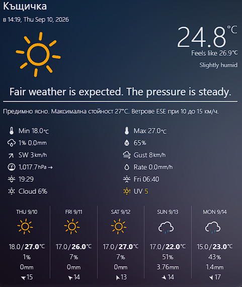

</td>
<td align="center" width="50%">

**Card with Charts section**

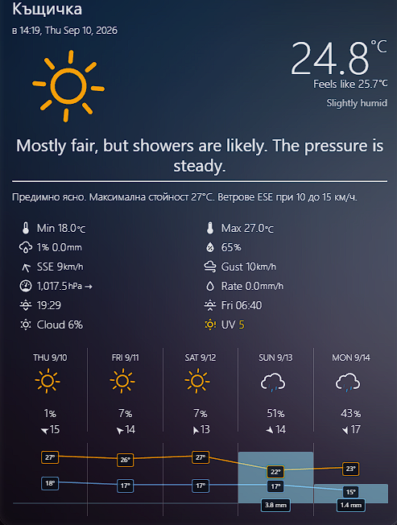

</td>
</tr>
<tr>
<td align="center" width="50%">

**Forecast hover tooltip**

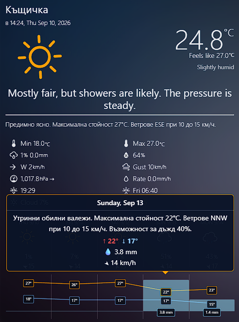

</td>
<td align="center" width="50%">

**Editor — section list**

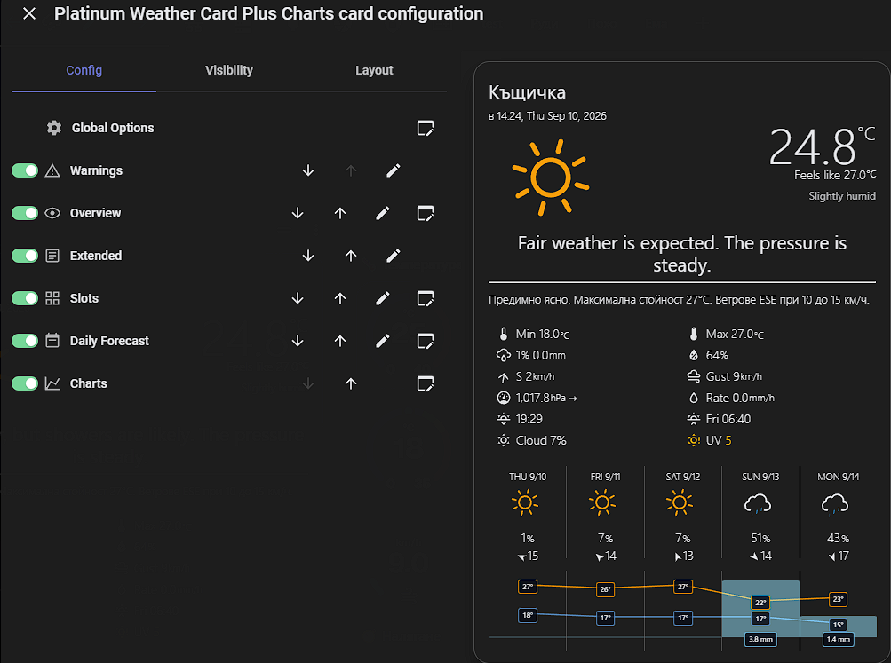

</td>
</tr>
<tr>
<td align="center" width="50%">

**Editor — Global Options (locale & icon pack)**

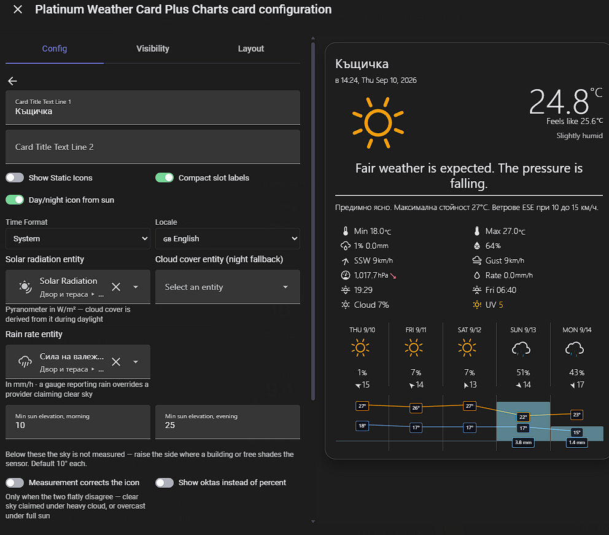

</td>
<td align="center" width="50%">

**Slot configuration in editor**

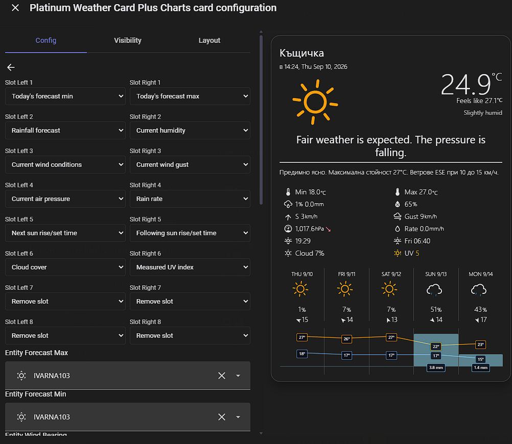

</td>
</tr>
<tr>
<td align="center" width="50%">

**Icon pack selection**

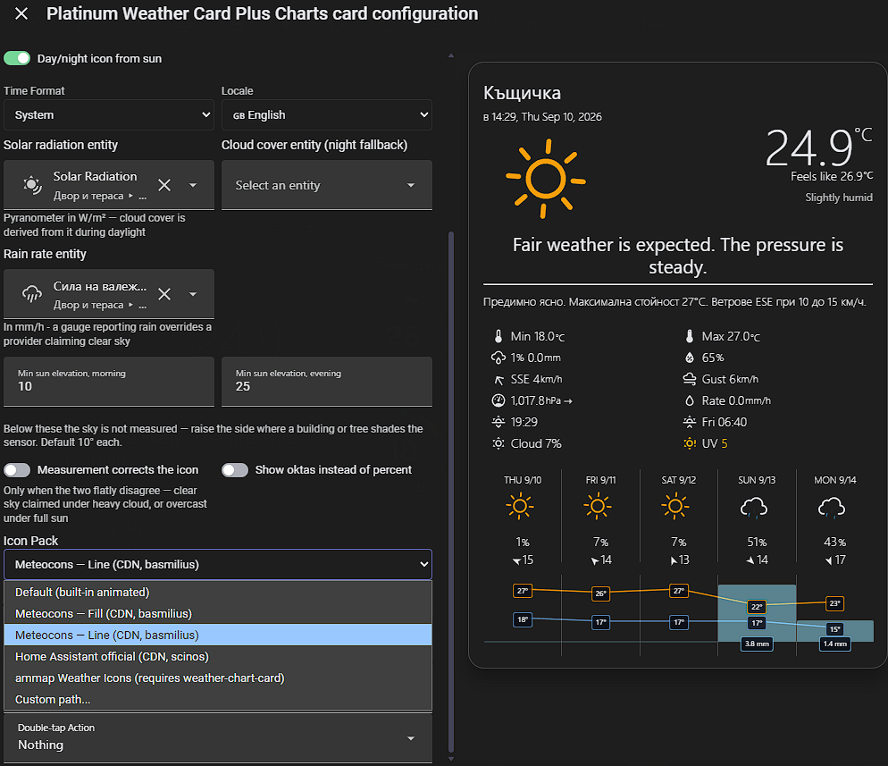

</td>
<td align="center" width="50%">

**Local Zambretti forecast (verbose)**

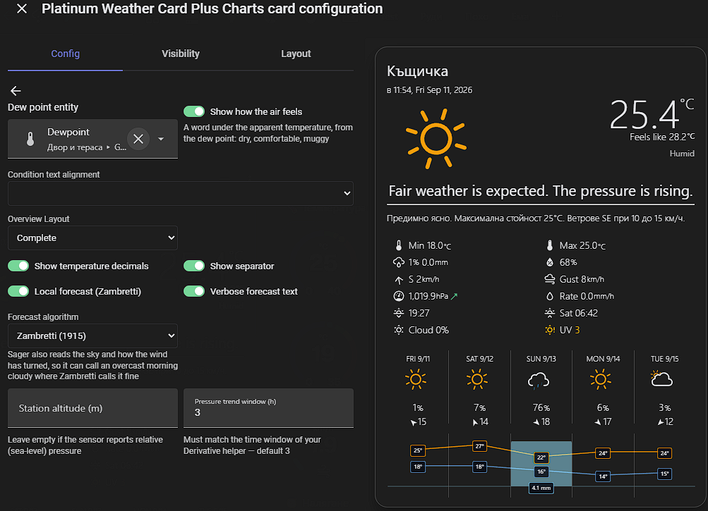

</td>
</tr>
</table>

---

# Sections

- Overview
- Extended
- Slots
- Daily Forecast
- **Charts**

Use the lock icon on each section header to hide it entirely, and the up/down buttons to reorder them. The **Global Options** section contains settings that affect multiple sections.

## Overview Section

Four layout options are available:

| Layout | Preview |
|--------|---------| 
| **Complete** |  |
| **Observations** |  |
| **Forecast** |  |
| **Title Only** |  |

| Option | Type | Description |
| ------ | ---- | ----------- |
| Card Title Text Line 1 | String | Optional title line 1 |
| Card Title Text Line 2 | String | Optional title line 2 |
| Entity Update Time | Entity | Entity providing the timestamp (RFC 3339 format) |
| &nbsp;&nbsp;Use Attribute | Boolean | Use an attribute of the above entity for the timestamp |
| &nbsp;&nbsp;Attribute | String | The attribute containing the timestamp |
| Update Time Prefix | String | Text to prepend to the timestamp |
| Entity Current Temperature | Entity | Current temperature |
| Entity Apparent Temperature | Entity | Apparent / feels-like temperature |
| Entity Forecast Icon | Entity | Entity whose state drives the condition icon |
| Entity Forecast Summary | Entity | Entity whose state is shown as the condition text |
| Show Temperature Decimals | Boolean | 1 decimal on current/apparent temperature |
| Show Separator | Boolean | Separator line below the overview section |
| Local forecast (Zambretti) | Boolean | Replace the summary text with a locally computed Zambretti forecast |
| &nbsp;&nbsp;Verbose forecast text | Boolean | Full-sentence forecast with a pressure-tendency clause |
| &nbsp;&nbsp;Station altitude (m) | Number | Only for absolute-pressure sensors — leave empty for relative/sea-level |

Wind bearing sensors may report either numeric degrees or compass text. Both Latin (`NW`, `SSE`) and Cyrillic (`СЗ`, `ЮЮИ`, and the Russian/Ukrainian `В` for east) abbreviations are recognised — some providers return them localized, or mixed in with the Latin ones.

### Tap on a value → history

Tapping a slot value (humidity, pressure, wind, ...) — or the big current temperature and the apparent temperature below it — opens the native more-info dialog with the history/statistics graph. Only slots backed by a real sensor are tappable — a pointer cursor and a subtle hover highlight show where. Slots reading attributes of a `weather.*` entity stay inert (their dialog would show a forecast, not history). The card-level tap/hold actions are unaffected. Controlled by `option_slot_tap_more_info` (Slots section toggle, on by default).

### Local forecast (Zambretti)

The card can compute a short local forecast entirely from your own weather station — no internet, no forecast provider. It implements the classic **Zambretti forecaster** (Negretti & Zambra, 1915), which reads barometric pressure, its trend, wind direction and season. It is reported to be right around 90% of the time for the next 12 hours — but that figure comes from the frontal weather it was designed for, and there are conditions it cannot see at all (see *What it can and cannot do* below).

Enable it in the editor: **Overview Section → Options → Local forecast (Zambretti)**. When enabled, the computed forecast text replaces the `entity_summary` text in the overview section, localized to the card's configured language (one of 26 phrases, e.g. *"Fine weather"*, *"Unsettled, rain later"*, *"Stormy, much rain"*).

A **Verbose forecast text** toggle expands the short phrase into a full sentence with a pressure-tendency clause, e.g. *"Unsettled weather, with rain expected later. The pressure is falling."*

| Short | Verbose |
|-------|---------|
| 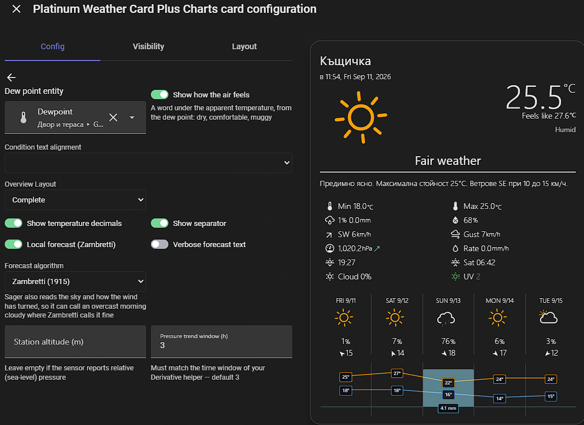 |  |

Inputs used:

- `entity_pressure` — **required.** Sea-level (relative) pressure preferred. Units are auto-converted from the sensor's `unit_of_measurement` (hPa/mbar, inHg, mmHg, kPa, psi, Pa).
- `entity_pressure_trend` — strongly recommended. A numeric derivative sensor in hPa/h gives the best result (±0.1 hPa/h is the rising/falling threshold); text states `rising`/`steady`/`falling` also work.
- `entity_wind_bearing` — optional, refines the forecast (degrees or compass text).
- **Station altitude** — only set this if your pressure sensor reports *absolute* (station) pressure; the card then applies the barometric sea-level correction using the current temperature. Leave empty for relative/sea-level sensors.

The hemisphere is detected automatically from your Home Assistant latitude.

#### What it can and cannot do

Zambretti is **purely barometric**. It infers the weather from the pressure level, which way the pressure is moving, and where the wind is coming from. That works because in the mid-latitude frontal weather it was built for — Britain in 1915 — pressure genuinely leads the weather: fronts announce themselves in the barometer hours before they arrive.

It follows that the algorithm is blind to anything that does not move the barometer:

- **Summer convective storms.** Thunderstorms often form under high pressure with no barometric signature whatsoever. The card can read *"fine weather"* while a storm is building overhead, and it is not wrong about the pressure — it simply has no way to see instability, moisture or lift. In a convective climate, treat the local forecast as one input among several rather than the authority.
- **Fog, frost, and anything driven by radiation or humidity.** No input, no output.
- **Terrain effects.** Sea breezes, valley winds, lake effect — all invisible to it.

Where it does well is the thing your forecast provider is often slowest on: a front arriving earlier or later than the model said. The barometer at your own location knows before the model updates.

None of this is fixable within Zambretti; the missing input is cloud cover, which is what later algorithms such as Sager (1942) use alongside pressure and wind change. If your station has a pyranometer the card can now measure that — see [Cloud cover from a pyranometer](#cloud-cover-from-a-pyranometer) — but feeding it into the forecast rather than just displaying it would mean a different algorithm, not a tweak to this one.

> **Your pressure sensor must report sea-level (relative) pressure — check this first.**
> Zambretti reads the absolute pressure level, so an uncalibrated station throws the forecast off by several categories, permanently. A station at 150 m altitude reads roughly 18 hPa below sea level: the algorithm sees 1002 hPa ("changeable, some rain") when the real sea-level pressure is 1020 hPa ("settled fair"), and the card then predicts rain on a cloudless day.
>
> **Ten-second check:** compare your absolute and relative pressure sensors. If they read *exactly* the same, the station is not applying any correction and you are feeding the card raw station pressure.
>
> Fix it in **one** of these two places, never both:
>
> - **In the station (recommended)** — Ecowitt/WSView Plus → Calibration → **Altitude for REL** (leave *Abs Offset* at 0.0, that field corrects the absolute reading, which is already right). This also fixes what the station uploads to Weather Underground and the like.
>
>   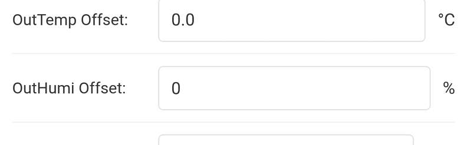
>
> - **In the card** — fill the *Station altitude (m)* field, and the card applies the barometric correction itself using the current temperature.
>
> To verify, compare the corrected value with the QNH from a nearby airport METAR — they should agree within a hPa or two.

To keep the text stable and honest about its inputs, the card applies three rules:

- **Wind direction is used only when it means something** — the reading is dropped below 8 km/h, and also whenever the bearing has been wandering over the last 15 minutes (measured as circular concentration, R < 0.7). A vane in light air sweeps the whole compass; professional stations report `VRB` for the same reason, and aviation reports state a range such as `040V120` — an 80° spread at 9 knots. Since Zambretti applies up to ±8.35 hPa based on the bearing, an unsteady reading alone can move the forecast several categories.
- **The pressure trend is corrected for the atmospheric tide, then judged conservatively.** Pressure breathes twice a day — maxima near 10:00 and 22:00 local solar time, minima near 04:00 and 16:00 — with an amplitude of about 1.16·cos²(latitude) hPa. At 43°N that is a slope of up to 0.32 hPa/h, several times any sensible "falling" threshold, so an uncorrected forecast deteriorates every afternoon and recovers every morning regardless of the weather. The card subtracts the expected tide (computed from your latitude and longitude, averaged over the trend sensor's window) and then applies hysteresis: rising/falling starts at ±0.30 hPa/h — roughly 0.9 hPa over three hours, the scale the original algorithm was built around — and returns to steady below ±0.20. A changed phrase must also persist for five minutes before it replaces the one on screen.

  The tidal correction has to be averaged over the same window your trend sensor uses — at three hours versus one they differ by up to 0.16 hPa/h, over half the threshold for calling the pressure falling. A Derivative helper does not expose its window on the entity, so set **Pressure trend window** in the editor to match it. Default is 3 hours, which is both the Derivative default and the window the original Zambretti algorithm was built around.
- **The pressure-tendency clause is read live** from the same source as the pressure slot's arrow, so the sentence and the arrow can never contradict each other.

```yaml
type: custom:platinum-weather-card-plus-charts
entity_pressure: sensor.ws_relative_pressure
entity_pressure_trend: sensor.pressure_trend
entity_wind_bearing: sensor.ws_wind_direction
option_local_forecast: true
# option_forecast_altitude: 550   # only for absolute-pressure sensors
```

## Extended Section

Shows today's detailed forecast text.

| Option | Type | Description |
| ------ | ---- | ----------- |
| Entity Extended Forecast | Entity | Entity providing the detailed forecast |
| &nbsp;&nbsp;Use Attribute | Boolean | Use an attribute of the entity instead of its state |
| &nbsp;&nbsp;Attribute | String | The attribute containing the forecast text |
| Entity Today's UV Forecast | String | Optional entity appended to the extended forecast |
| Entity Today's Fire Danger | String | Optional entity appended to the extended forecast |

## Slots Section

Up to 8 rows of data in 2 columns. The required entities update dynamically based on which slots are selected.

| Slot Value | Description | Example |
| ---------- | ----------- | ------- |
| `humidity` | Current humidity | 36% |
| `rainfall` | Today's recorded rainfall | 5mm |
| `pressure` | Current air pressure | 1018hPa |
| `wind` | Wind direction, speed and gust | SSE 9km/h (Gust 13km/h) |
| `wind_kt` | Wind in knots | SSE 5Kt (Gust 6Kt) |
| `visibility` | Current visibility | 70km |
| `observed_max` | Today's observed maximum | Observed Max 19°C |
| `observed_min` | Today's observed minimum | Observed Min 4°C |
| `forecast_max` | Today's forecast maximum | Forecast Max 19°C |
| `forecast_min` | Today's forecast minimum | Forecast Min 1°C |
| `temp_next` | Next min or max | Overnight Min 4°C |
| `temp_following` | Following min or max | Tomorrow's Max 20°C |
| `temp_maximums` | Observed and forecast max | Obs Max 15°C (Fore 19°C) |
| `temp_minimums` | Observed and forecast min | Obs Min 13°C (Fore 1°C) |
| `sun_next` | Next sunrise or sunset | 7:10pm |
| `sun_following` | Following sunrise or sunset | Mon 6:35am |
| `moon` | Moon phase with dynamic icon and translated name | Растяща луна |
| `pop` | Chance of rain | 10% |
| `popforecast` | Rainfall forecast | 10% - 3 to 6mm |
| `possible_today` | Forecast rain today | Forecast 15-25mm |
| `possible_tomorrow` | Forecast rain tomorrow | Fore Tom 5-10mm |
| `uv_summary` | UV forecast | UV High |
| `fire_danger` | Fire danger | Moderate |
| `custom1`–`custom4` | Custom entity with icon and unit | |
| `empty` | Blank slot (preserves space) | |
| `remove` | Remove slot entirely | |


### Pressure trend indicator

If you point `entity_pressure_trend` at a trend sensor, the pressure slot shows a small colored arrow next to the value: ↗ green (rising), → gray (steady), ↘ red (falling). Accepted sensor values: numeric rate of change (± beyond 0.05 counts as rising/falling) or the text states `rising` / `steady` / `falling`.

The easiest source is a **Derivative helper** (Settings → Devices & Services → Helpers → Create helper → Derivative):

- **Source:** your barometric pressure sensor
- **Time window:** 3 hours (the meteorological standard for pressure tendency)
- **Time unit:** hours (output becomes hPa/h)

Or in YAML:

```yaml
sensor:
  - platform: derivative
    source: sensor.your_pressure_sensor
    name: Pressure trend
    unit_time: h
    time_window: "03:00:00"
    round: 2
```

Then select it in the editor: Slots Section → *Entity Pressure Trend* (the picker appears once a pressure entity is set).

## Warnings Section

Shows an active severe-weather warning as a coloured row. Point it at a [MeteoAlarm](https://www.home-assistant.io/integrations/meteoalarm/) binary sensor (or any integration exposing the same CAP attributes) and the row appears only while a warning is in force — the rest of the time the section takes no space at all.

The wording is the card's own, in the card's language, rather than the provider's: MeteoAlarm reports the hazard as numbered strings following the EUMETNET CAP profile (`awareness_type: "5; high-temperature"`, `awareness_level: "2; yellow; Moderate"`), and the card keys off those numbers. So a Bulgarian card reads *"Жълт код: Високи температури · до сб 00:00"* even though the feed itself is in English. All fifteen hazard types are translated in every language the card supports; unknown types fall back to the provider's own `event` text.

The colour of the row follows the warning level — yellow, orange or red.

| Option | Type | Description |
| ------ | ---- | ----------- |
| Warning entity | Entity | MeteoAlarm-compatible binary sensor |
| Show expiry time | Boolean | Append when the warning ends |

```yaml
type: custom:platinum-weather-card-plus-charts
section_order:
  - overview
  - warnings
  - slots
entity_warning: binary_sensor.meteoalarm_varna
```

> The MeteoAlarm integration reports only the first warning when several are active for the same region at once. That is a limitation of the integration rather than the card; a template sensor can work around it if you need every warning.

### Cloud cover from a pyranometer

If your station measures solar radiation, the card can work out the cloud cover from it. How much sunlight *would* arrive under a clear sky depends only on the sun's elevation, the day of year and your altitude — pure geometry, no external data — so the ratio between that and what the sensor actually reports is the cloud cover.

Point **Solar radiation entity** in Global Options at your pyranometer (W/m²); a sun entity is needed too, since the calculation turns on the sun's elevation. From there the measurement is available to two independent things: add the **Cloud cover** slot to show it as a reading, and switch on **Measurement corrects the icon** to let it correct the condition icon. Either without the other is fine.

Worth knowing about its limits:

- **Daylight only.** At night there is no signal at all. The slot falls back to a provider's cloud cover entity if you configure one, and shows `---` otherwise.
- **It stops below 10° of elevation**, where the air-mass model softens and morning haze distorts the reading, rather than reporting confident nonsense at dawn and dusk.
- **The clear-sky model uses a fixed atmospheric transmittance**, so it reads a little high in hazy or dusty air and a little low in very clean air. Good enough to tell clear from overcast; not a radiometric instrument.
- **The sensor must be clean, level and unshaded.** A pyranometer that catches a roof edge each morning will report cloud that isn't there, every morning.

The measurement can also correct the condition icon, under **Measurement corrects the icon**. The icon then follows the ordinary cloud bands — clear below 25%, lightly cloudy to 55%, cloudy to 85%, overcast above — rather than the provider's guess. Only the plain sky icons are touched: rain, snow and fog are things a provider knows about and a pyranometer cannot see, so those are left alone. Off by default.

The bands are the meteorological ones rather than wide safety margins. A sensor reading badly enough to matter is a sensor to clean, and treating it as untrustworthy while still displaying its number in a slot would be the worse of the two positions.

## Icon Packs

The card supports multiple icon packs, selectable from the editor's **Global Options → Icon Pack** dropdown.

| Value | Description | Requirement |
|---|---|---|
| `default` | Built-in animated SVG icons (bundled with the card) | None |
| `meteocons-fill` | [Meteocons](https://github.com/basmilius/weather-icons) by Bas Milius — filled style | Internet (jsDelivr CDN) |
| `meteocons-line` | [Meteocons](https://github.com/basmilius/weather-icons) by Bas Milius — line style | Internet (jsDelivr CDN) |
| `wcc-2` | [ammap Weather Icons](https://www.ammap.com/) — included in `rudizl/weather-chart-card` | Install `rudizl/weather-chart-card` via HACS |
| `custom` | Any icon set — set `icon_pack_path` with `{condition}` placeholder | User-provided |

> **Note:** `wcc-1` has been removed — it was byte-for-byte identical to the Meteocons Fill pack. Use `meteocons-fill` instead.

For `custom`, set `icon_pack_path` to a path template such as `/local/my-icons/{condition}.svg`. The `{condition}` placeholder is replaced with the HA weather condition name (e.g. `clear-day`, `partlycloudy`, `rain`).

### Third-party icon licenses

| Icon pack | Author | License |
|---|---|---|
| [basmilius/weather-icons](https://github.com/basmilius/weather-icons) (Meteocons) | [Bas Milius](https://bas.dev) | [MIT](https://github.com/basmilius/weather-icons/blob/master/LICENSE) |
| [amCharts Weather Icons](https://www.amcharts.com/free-animated-svg-weather-icons/) (via `rudizl/weather-chart-card`, `wcc-2`) | amCharts / ammap.com | [CC BY 4.0](https://creativecommons.org/licenses/by/4.0/) — free including commercial use, attribution required |

> **Note:** The card's **default built-in icons** are also based on amCharts weather icons, extended by [@makin-things](https://github.com/Makin-Things/weather-icons).

## Daily Forecast Section

Two layout options: **Horizontal** (default, up to 5 days) and **Vertical** (up to 7 days).

Hovering over any forecast day column shows a tooltip with date, weather description, max/min temperatures, precipitation, and wind speed/direction. The tooltip content is identical to the Charts section tooltip.

| Option | Type | Description |
| ------ | ---- | ----------- |
| Weather Entity with Forecasts | String | Main weather entity for forecast data |
| Forecast Type | String | `daily`, `hourly`, or `twice_daily` |
| Entity Forecast Icon 1 | String | Entity for forecast condition icon |
| Entity Forecast Summary 1 | String | Entity for forecast summary text (also used in hover tooltips) |
| Entity Forecast Min 1 | String | Forecast minimum temperature |
| Entity Forecast Max 1 | String | Forecast maximum temperature |
| Entity Forecast Chance of Rain 1 | String | Precipitation probability |
| Entity Forecast Possible Rain 1 | String | Estimated rainfall amount |
| Entity Extended Forecast 1 | String | Detailed forecast text (vertical only) |
| Entity Fire Danger 1 | String | Fire danger forecast (vertical only) |
| Include Today in Forecast | Boolean | Start the strip from today instead of tomorrow |
| Show date next to day | Boolean | Locale-formatted date after the day name (day label font shrinks to fit) |
| Show forecast wind | Boolean | Wind speed/direction in each forecast column |

With **Show date next to day** enabled:

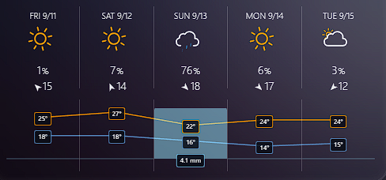

## Charts Section

An integrated chart rendered directly below the daily forecast, showing the same days as the forecast strip.

| Option | Type | Description |
| ------ | ---- | ----------- |
| Show Temperature Chart | Boolean | Show max/min temperature polylines |
| Show Precipitation Chart | Boolean | Show precipitation bars with mm labels |

The chart uses the same weather entity forecast subscription as the daily forecast section. No additional entities are required.

Hovering over any chart column shows the same tooltip as hovering over the corresponding forecast column.

### Forecast columns and the Charts section

When the **Charts section is disabled**, max/min temperature and precipitation are shown as text directly in each forecast column:

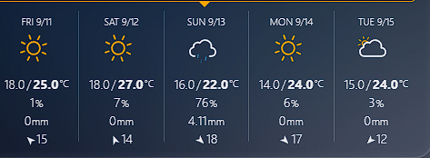

When the **Charts section is enabled**, the same data is rendered visually as temperature lines (max in orange, min in blue) and precipitation bars in the chart strip below the forecast. The text values are automatically hidden to avoid duplication — the chart already tells the full story.

## Global Options

| Option | Type | Description |
| ------ | ---- | ----------- |
| Icon Pack | String | `default`, `meteocons-fill`, `meteocons-line`, `wcc-2`, or `custom` |
| Icon Pack Path | String | Path template for `custom` icon pack (e.g. `/local/icons/{condition}.svg`) |
| Show Static Icons | Boolean | Disable animated icons |
| Time Format | String | `system` (follows HA Settings → Profile), `12hour`, or `24hour` |
| Locale | String | Locale for timestamp and moon phase formatting. Supported: `bg`, `ru`, `ua`, `de`, `fr`, `it`, `nl`, `pl`, `da`, `es`, `he` — when empty, the card follows the Home Assistant interface language |
| Compact slot labels | Boolean | Shorter slot label wording (`option_compact_slots`) |
| Show Gust in Wind Slot | Boolean | Append the gust value to the wind slot |
| Show Beaufort | Boolean | Prefix the wind slot with the Beaufort force |

---

# YAML Reference

Almost all settings can be configured in the GUI editor. The YAML reference below is for advanced use or bulk configuration. Access it via **Show Code Editor** in the card editor.

## Global Settings

| Variable | Type | Default | Description |
| -------- | ---- | ------- | ----------- |
| `type` | String | — | Must be `custom:platinum-weather-card-plus-charts` |
| `section_order` | List | overview, extended, slots, daily_forecast, charts | Section display order |
| `show_section_overview` | Boolean | `true` | Show/hide overview section |
| `show_section_extended` | Boolean | `true` | Show/hide extended section |
| `show_section_slots` | Boolean | `true` | Show/hide slots section |
| `show_section_daily_forecast` | Boolean | `true` | Show/hide daily forecast section |
| `show_section_charts` | Boolean | `true` | Show/hide charts section |
| `tap_action` | Action | none | Action on tap |
| `hold_action` | Action | none | Action on hold |
| `double_tap_action` | Action | none | Action on double-tap |
| `option_static_icons` | Boolean | `false` | Use non-animated icons |
| `icon_pack` | String | `default` | Icon pack: `default`, `meteocons-fill`, `meteocons-line`, `wcc-2`, `custom` |
| `icon_pack_path` | String | — | Path template for custom icon pack |

## Actions

The card supports all standard [HA actions](https://www.home-assistant.io/dashboards/actions/), configurable from **Global Options → Actions** in the editor:

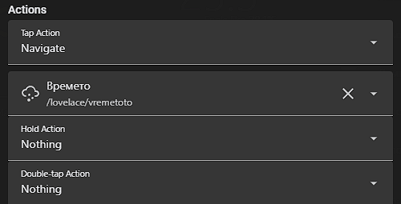

Some YAML examples:

```yaml
# Tap — show more-info for a specific entity
tap_action:
  action: more-info
entity: weather.my_weather

# Hold — navigate to another dashboard view
hold_action:
  action: navigate
  navigation_path: /lovelace/misc

# Double-tap — toggle a light
double_tap_action:
  action: call-service
  service: light.toggle
  target:
    entity_id: light.living_room
```

| `option_time_format` | String | `system` | `system` (follows HA Settings → Profile), `12hour` or `24hour` |
| `option_locale` | String | none | Locale for timestamp and moon phase: `bg`, `ru`, `ua`, `de`, `fr`, `it`, `nl`, `pl`, `da`, `es`, `he` |
| `text_update_time_prefix` | String | none | Prefix for the update time display |

## Overview Settings

| Variable | Type | Default | Description |
| -------- | ---- | ------- | ----------- |
| `overview_layout` | String | `complete` | `complete`, `observations`, `forecast` or `title only` |
| `option_show_overview_decimals` | Boolean | `false` | Show 1 decimal on current/apparent temperature |
| `option_show_overview_separator` | Boolean | `false` | Show separator below overview section |
| `text_card_title` | String | none | Title line 1 |
| `text_card_title_2` | String | none | Title line 2 |
| `entity_update_time` | String | none | Entity providing the update timestamp |
| `update_time_use_attr` | Boolean | `false` | Use attribute for the timestamp |
| `update_time_name_attr` | String | none | Attribute name for the timestamp |
| `entity_temperature` | String | none | Current temperature entity |
| `entity_apparent_temp` | String | none | Apparent temperature entity |
| `entity_forecast_icon` | String | none | Forecast icon entity |
| `entity_summary` | String | none | Forecast summary entity |
| `forecast_text_alignment` | String | `center` | `left`, `center` or `right` for the condition text |
| `option_local_forecast` | Boolean | `false` | Compute a local Zambretti forecast and show it as the overview summary text (uses `entity_pressure`, `entity_pressure_trend`, `entity_wind_bearing`, `entity_wind_speed`) |
| `option_local_forecast_verbose` | Boolean | `false` | Full-sentence forecast text with a pressure-tendency clause |
| `option_forecast_altitude` | Number | none | Station altitude in meters — set only when the pressure sensor reports absolute pressure |
| `option_trend_window_hours` | Number | `3` | Time window of your pressure trend sensor, in hours — the tidal correction is averaged over it |

## Extended Section

| Variable | Type | Default | Description |
| -------- | ---- | ------- | ----------- |
| `entity_extended` | String | none | Extended forecast entity |
| `extended_use_attr` | Boolean | `false` | Use attribute of the entity |
| `extended_name_attr` | String | none | Attribute name |
| `option_extended_separator` | Boolean | `true` | Put each source on its own line instead of running them together |
| `entity_todays_uv_forecast` | String | none | UV forecast entity |
| `entity_todays_fire_danger` | String | none | Fire danger entity |

## Slots Section

| Variable | Type | Default | Description |
| -------- | ---- | ------- | ----------- |
| `slot_l1`–`slot_l8` | Slot | see below | Left column slots 1–8 |
| `slot_r1`–`slot_r8` | Slot | see below | Right column slots 1–8 |
| `entity_pop` | String | none | Required for `pop`, `popforecast` |
| `entity_pos` | String | none | Required for `popforecast`, `possible_today` |
| `entity_possible_tomorrow` | String | none | Required for `possible_tomorrow` |
| `entity_rainfall` | String | none | Required for `rainfall` |
| `entity_humidity` | String | none | Required for `humidity` |
| `entity_pressure` | String | none | Required for `pressure` |
| `entity_pressure_trend` | String | none | Optional trend sensor — shows a colored ↗/→/↘ arrow next to the pressure value |
| `pressure_units` | String | none | Optional pressure unit label |
| `entity_observed_max` | String | none | Required for `observed_max`, `temp_maximums` |
| `entity_observed_min` | String | none | Required for `observed_min`, `temp_minimums` |
| `entity_forecast_max` | String | none | Required for `forecast_max`, `temp_maximums` |
| `entity_forecast_min` | String | none | Required for `forecast_min`, `temp_minimums` |
| `entity_temp_next` | String | none | Required for `temp_next` |
| `entity_temp_next_label` | String | none | Required for `temp_next` |
| `entity_temp_following` | String | none | Required for `temp_following` |
| `entity_temp_following_label` | String | none | Required for `temp_following` |
| `entity_uv_alert_summary` | String | none | Required for `uv_summary` |
| `entity_fire_danger` | String | none | Required for `fire_danger` |
| `entity_wind_bearing` | String | none | Required for `wind`, `wind_kt` |
| `entity_wind_speed` | String | none | Required for `wind`; wind speed unit is read automatically from the weather entity attributes |
| `entity_wind_gust` | String | none | Required for `wind` |
| `entity_wind_speed_kt` | String | none | Required for `wind_kt` |
| `entity_wind_gust_kt` | String | none | Required for `wind_kt` |
| `entity_visibility` | String | none | Required for `visibility` |
| `entity_sun` | String | none | Required for `sun_next`, `sun_following` |
| `entity_moon` | String | none | Required for `moon` (HA Moon integration sensor) |
| `custom1_value`–`custom4_value` | String | none | Entity for custom slot |
| `custom1_icon`–`custom4_icon` | Icon | none | MDI icon for custom slot |
| `custom1_units`–`custom4_units` | String | none | Unit label for custom slot |
| `custom1_label`–`custom4_label` | String | none | Optional text label shown before the value |
| `option_today_temperature_decimals` | Boolean | `false` | 1 decimal on temperature slots |
| `option_today_rainfall_decimals` | Boolean | `false` | 1 decimal on rainfall slots |
| `option_forecast_decimals` | Boolean | `false` | 1 decimal on forecast temperatures |
| `option_show_forecast_pop` | Boolean | `true` | Show precipitation probability in forecast |
| `option_pressure_decimals` | Number | `0` | Decimal places for pressure: `0`–`3` |
| `option_wind_decimals` | Number | `0` | Decimals on wind speed and gust (0–2) — worth setting in m/s, where whole numbers are coarse |
| `option_color_fire_danger` | Boolean | `true` | Colour fire danger by severity |
| `option_wind_bearing_icon` | Boolean | `false` | Show the wind bearing as a rotating arrow icon instead of compass text |
| `option_compact_slots` | Boolean | `false` | Shorter slot label wording (Max, Min, ...) |
| `option_sun_overrides_icon` | Boolean | `true` | Force the day/night variant of the current condition icon from the sun's elevation, overriding the provider |
| `option_moon_icon_only` | Boolean | `false` | Show only the moon phase icon, without the text |
| `entity_solar_radiation` | String | none | Pyranometer in W/m², for the cloud cover slot |
| `entity_cloud_cover` | String | none | Provider cloud cover, used at night when the pyranometer cannot help |
| `option_cloud_cover_oktas` | Boolean | `false` | Show oktas instead of a percentage |
| `option_slot_tap_more_info` | Boolean | `true` | Tap on a slot value opens the more-info history dialog |
| `entity_warning` | String | none | MeteoAlarm-compatible binary sensor for the warnings section |
| `option_warning_show_expiry` | Boolean | `true` | Show when the warning expires |
| `option_show_gust_in_wind` | Boolean | `true` | Append the wind gust to the wind slot, e.g. "SE 12 (Gust 20) km/h" |
| `option_show_beaufort` | Boolean | `false` | Prefix the wind slot with the Beaufort force, e.g. "BFT: 4 - SE 12 km/h" |

Default slot values: l1=`forecast_max`, l2=`forecast_min`, l3=`wind`, l4=`pressure`, l5=`sun_next`, l6–l8=`remove`, r1=`popforecast`, r2=`humidity`, r3=`uv_summary`, r4=`moon`, r5=`sun_following`, r6–r8=`remove`.

## Daily Forecast Section

| Variable | Type | Default | Description |
| -------- | ---- | ------- | ----------- |
| `weather_entity` | String | — | Main weather entity for forecasts |
| `forecast_type` | String | `daily` | `daily`, `hourly`, or `twice_daily` |
| `daily_forecast_layout` | String | `horizontal` | `horizontal` or `vertical` |
| `daily_forecast_days` | Number | `5` | Days to show: 1–5 (horizontal), 1–7 (vertical) |
| `option_tooltips` | Boolean | `false` | Enable hover tooltips on horizontal forecast columns |
| `option_show_current_day` | Boolean | `false` | Include today in forecast strip |
| `option_daily_forecast_date` | Boolean | `false` | Show a locale-formatted date (e.g. 13.07) next to the day name |
| `option_show_forecast_wind` | Boolean | `false` | Show forecast wind speed/direction in each column |
| `entity_summary_1` | String | none | Weather summary sensor for day 1 tooltip (auto-incremented for each day) |
| `entity_extended_1` | String | none | Extended forecast text for day 1, vertical layout (auto-incremented for each day) |
| `daily_extended_use_attr` | Boolean | `false` | Read the extended forecast text from an attribute of `entity_extended_1` instead of its state |
| `daily_extended_name_attr` | String | none | Name of that attribute |
| `daily_extended_forecast_days` | Number | `7` | Extended forecast days (vertical only, 0–7) |
| `option_daily_color_fire_danger` | Boolean | `true` | Colour fire danger (vertical only) |
| `old_daily_format` | Boolean | `false` | Stack max/min vertically instead of side by side |
| `tempformat` | String | — | `highlow` = show max before min |

## Charts Section

| Variable | Type | Default | Description |
| -------- | ---- | ------- | ----------- |
| `show_section_charts` | Boolean | `true` | Show/hide the charts section |
| `option_show_temperature_chart` | Boolean | `true` | Show max/min temperature lines |
| `option_show_precipitation_chart` | Boolean | `true` | Show precipitation bars |

The chart uses the same `weather_entity` and `daily_forecast_days` settings as the Daily Forecast section. No additional entities are required.

[license-shield]: https://img.shields.io/github/license/rudizl/platinum-weather-card-plus-charts.svg?style=flat
[releases-shield]: https://img.shields.io/github/v/release/rudizl/platinum-weather-card-plus-charts?style=flat
[releases]: https://github.com/rudizl/platinum-weather-card-plus-charts/releases
